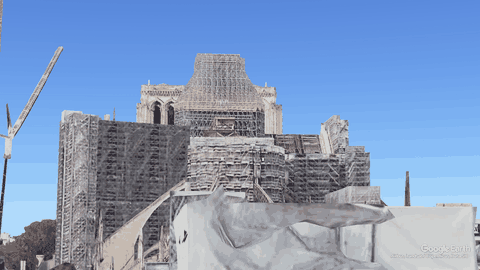

<div align="center">

# Sky2Ground: A Benchmark for Site Modeling under Varying Altitude (Under Construction 🚧)
> **Note:** This repository is currently under active development. Some features or source files may be missing until the initial release.
> 
[Zengyan Wang](), [Sirshapan Mitra](), [Rajat Modi](), [Grace Lim](), [Yogesh Rawat]()

**CVPR 2026**

[[`arXiv`](https://arxiv.org/abs/2603.13740)]
[[`Dataset`](https://www.kaggle.com/datasets/zhyw86/varying-altitude-dataset)]
<!-- [[`Project Page`](https://aerial-megadepth.github.io/)] 

[[`Bibtex`](#citation)] -->

</div>

## 🖼 Dataset Preview

Our dataset bridges the gap between synthetic environments and real-world captures. Below are samples of the multi-view perspectives provided.

### 🌐 Synthetic Dataset (GIF Samples)
*Generated environments featuring a full 5-view suite.*

<p align="center">
  
  
  
  
  
  <br>
  <em>Satellite | Aerial View 1 | Aerial View 2 | Aerial View 3 | Street View</em>
</p>

---

### 📸 Real-World Dataset (Static Images)
*Authentic captures for domain validation.*

<p align="center">
  
  
  
   
   
  <br>
  <em>Satellite | Single Aerial View | Street View 1 | Street View 2 | Street View 3 </em>
</p>

> **Note:** Real-world samples are provided as high-resolution static images, while synthetic samples include dynamic transitions (GIFs) to demonstrate environmental variance.

## 🚀 Access the Dataset

The dataset will be available on the following platforms for ease of use in machine learning workflows:

| Platform | Link | Recommended For |
| :--- | :--- | :--- |
| **Hugging Face** | [🤗 Under Construction](https://huggingface.co/datasets/letsGoBlind/Sky2Ground/tree/main) 
| **Kaggle** | [📁 Under Construction](https://www.kaggle.com/datasets/zhyw86/varying-altitude-dataset)

---

## 🛠 Project Progress

- [x] Synthetic Images
- [ ] Real Images
- [ ] Benchmark

## Citation
If you find our work to be useful in your research, please consider citing our paper:

```bibtex
@misc{wang2026sky2groundbenchmarksitemodeling,
      title={Sky2Ground: A Benchmark for Site Modeling under Varying Altitude}, 
      author={Zengyan Wang and Sirshapan Mitra and Rajat Modi and Grace Lim and Yogesh Rawat},
      year={2026},
      eprint={2603.13740},
      archivePrefix={arXiv},
      primaryClass={cs.CV},
      url={https://arxiv.org/abs/2603.13740}, 
}
```

